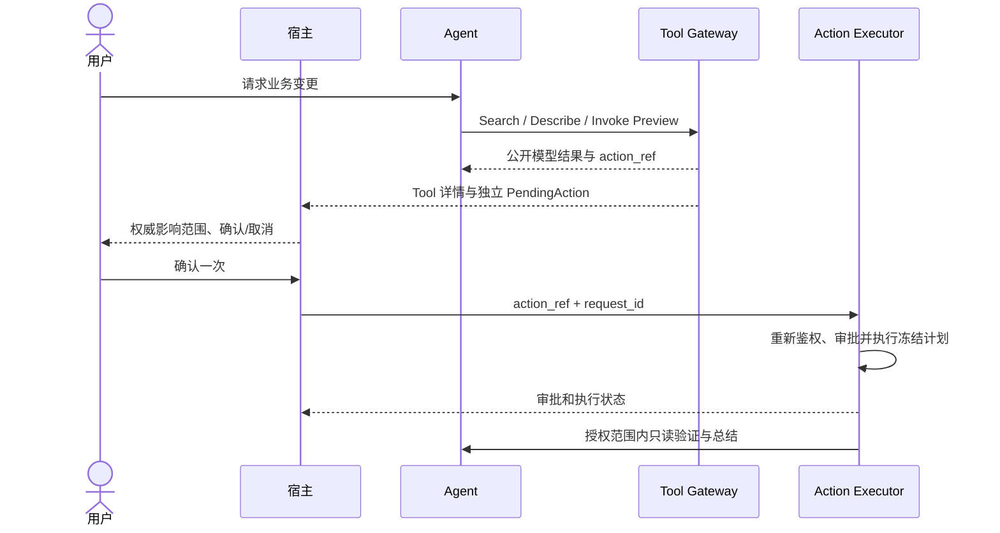
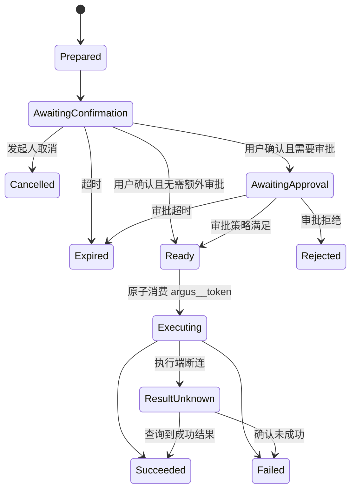

# Agent、MCP 与两阶段操作

> Agent 查询和操作复用主体的显式资源授权结果。创建工具不要求已有显式资源授权，提交成功后创建事务授予创建主体只读授权；读取、编辑、删除均要求功能权限、读取权限和目标资源授权。

## 1. 职责边界

Chatbox 和 Model Agent 负责：

- 理解意图。
- 收集缺少的参数。
- 选择和调用 MCP Tool。
- 生成执行计划。
- 请求用户确认。
- 组织回答。自有 Tool 的同包 Builder 生成展示数据，Agent 不选择、读取或生成模板。

MCP Tool 和领域服务负责：

- 业务校验。
- 企业、资源、Tool、显式资源授权、授权版本和显式资源授权校验。
- 幂等与状态持久化。
- 访问数据库、Connector 和第三方 API。
- 返回结构化结果和结构化错误。
- 写入审计。

人工 RemoteAccessSession 不属于 Model Agent 或 MCP Tool 能力。创建 SSH Web Terminal 使用管理 UI/OpenAPI 的独立授权接口、MFA/JIT/审批和短期一次性票据；AI、交互工具详情和 OpenSandbox 不能获得该票据。当前版本不提供定时无人值守任务。交互式会话中的人工命令不逐条走 Tool Preview/Commit，必须由会话级权限、时长、录像、剪贴板/文件传输策略和审计约束。

Conversation 和 Run 只绑定服务端确认的 `enterprise_id`。模型生成的企业、标签过滤条件、Host 或 Kubernetes ID 只是候选参数，不能切换当前身份域或扩大显式资源授权；每个 ToolCall、Run、PendingAction 和 Execution 保存实际目标资源引用和授权版本快照。

## 2. 自有 Tool 设计

Tool 分成两类：

- 查询/诊断 Tool：不改变服务端或目标环境状态，可以单阶段执行，例如 `.list`、`.get`、`.query`、`.status` 和 `.test_connection`。
- 变更 Tool：改变持久数据、远端资源、权限、凭证、配置、软件版本或网络拓扑，必须成对提供同名前缀的 `.preview` 和 `.commit`。

命名和 Schema 是强制协议，不允许出现只有 Preview 没有 Commit、Commit 额外接受新业务参数，或使用单个写 Tool 通过 `dry_run=true/false` 切换语义的情况。

示例 Tool：

```text
connector.list
connector.create_enrollment_token
host.create.preview
host.create.commit
host.test_connection
host.list
host.get
kubernetes.cluster.create.preview
kubernetes.cluster.create.commit
kubernetes.cluster.list
kubernetes.cluster.get
kubernetes.namespace.list
kubernetes.node.list
kubernetes.pod.list
kubernetes.pod.get
kubernetes.deployment.list
kubernetes.statefulset.list
kubernetes.daemonset.list
kubernetes.service.list
kubernetes.pod.logs
telemetry.host.install.preview
telemetry.host.install.commit
telemetry.kubernetes.install.preview
telemetry.kubernetes.install.commit
telemetry.group.create.preview
telemetry.group.create.commit
telemetry.gateway.enable.preview
telemetry.gateway.enable.commit
telemetry.route.test
telemetry.collector.config.preview
telemetry.collector.config.commit
telemetry.collector.repair.preview
telemetry.collector.repair.commit
telemetry.collector.status
telemetry.metrics.query
telemetry.logs.query
pending_action.cancel
```

取消采用统一的 `pending_action.cancel`，它接收公开 `action_ref` 并再次检查用户和会话；取消不是业务 Commit，不需要向模型暴露私有 Token。查询、预览和提交必须显式区分，高风险 Tool 不应依靠模型记住“刚才已经确认”。

Tool Registry 在执行前统一校验当前 Subject 的 Tool 权限、ServiceAccount `allowed_tool_ids`、严格 Input Schema、风险/执行模式和显式资源授权。模型输出中的未知字段、非法类型、截断 JSON 或调用方自报来源均不能进入领域 Service。

### 2.1 Preview/Commit 强制配对约定

对任意变更前缀 `x.y.operation`：

```text
x.y.operation.preview(candidate_parameters) -> public preview + private argus__token
x.y.operation.commit(argus__token) -> execution/result
```

`preview` 负责：

1. 当前身份、企业、Tool 权限、显式资源授权、目标资源和 AuthorizationVersion 校验。
2. 参数 Schema、业务规则、连接和资源状态检查。
3. 根据真实资源计算最终风险与审批策略。
4. 生成不可变执行计划、预览摘要、参数哈希和执行前置条件。
5. 持久化 Pending Action，生成公开 `action_ref` 和私有 `argus__token`。
6. 返回固定版本的公开结果和私有 `_meta.argus__token`。

`commit` 负责：

1. 只接收私有 `argus__token`；调用者不能重新提交业务参数。
2. 原子校验 Token 哈希、一次性状态、过期、目标 Commit Tool 和调用来源。
3. 重新检查当前用户、企业状态、功能权限、显式资源授权、AuthorizationVersion、审批、资源版本和前置条件。
4. 把 Pending Action 原子推进到 Executing，并创建 Execution/ConnectorCommand。
5. 使用服务端保存的不可变计划执行，返回可审计结果。

### 2.2 Commit 输入约定

Commit 的 MCP 输入 Schema 固定为：

```json
{
  "argus__token": "opaque-secret",
  "execution_context": {
    "action_binding_id": "cab_01K2...",
    "request_id": "req_01K2..."
  }
}
```

其中 `execution_context` 由 Action Executor 生成和签名，不接受浏览器或模型提供的同名字段。业务参数、目标 ID、版本、远程路径、脚本和 Artifact 均从 Pending Action Store 恢复。

## 3. Tool Result 与数据来源

每次调用持久化 ToolCall 与来源、工具版本、Schema Hash、派发状态、授权范围和完整结果 Hash。模型只收到有界投影及 `result_ref`。完整结果最大 64 MiB，小于 4 MiB 可内联保存，更大结果进入私有对象存储。

自有 Tool 的 Presentation Builder 在同包内绑定固定模板，生成独立详情数据与资源/结果引用。模板源码、确认控件和私有提交计划不进入 ToolResult 模型投影。外接 MCP 不使用模板扩展。

`workflow.import_result` 受控导入当前会话结果到 Workspace，服务端验证企业、会话、当前授权与结果 Hash。`workflow.publish_file` 发布已核验的工作文件为不可变私有交付；工作目录同名文件后来改变不会修改历史下载。

## 4. Agent Harness 与持久化 Run

Agent Loop、上下文账本、ToolResult Projection、ContextSnapshot、Token 预算和压缩恢复的完整契约见[Agent Harness 与上下文管理](./16-agent-harness-and-context-management.md)。本节只描述它与持久化 Run 和两阶段操作的关系。

多步骤任务必须落到 Run 状态机：

```text
Run
├── Step 1：查询 Connector
├── Step 2：测试目标连通性
├── Step 3：创建预览
├── Step 4：等待用户确认
├── Step 5：执行提交
└── Step 6：验证结果
```

Run 支持：

- 暂停和恢复。
- 等待用户输入或审批。
- 服务重启后恢复。
- 超时、取消和重试。
- 上下文预算、ToolResult Projection 和可恢复 Compaction。
- 每一步独立审计。

Run、Step 和 Task 的唯一状态保存于 PostgreSQL。Server 创建 Task 时在同一事务写入 Outbox；Worker 使用 Lease、Fence Token 和条件更新领取任务。Redis Stream/PubSub 只通知“可能有新任务”，不能作为任务是否存在或是否完成的事实来源。

```text
pending -> leased -> running -> waiting_input / waiting_approval
                     └───────→ succeeded / failed / cancelled / timed_out
```

Worker 失联后，只有 Lease 过期且数据库中的 Fence Token 未变化时，其他 Worker 才能接管。对具有外部副作用的 Step，接管前必须查询 Execution/ConnectorCommand 结果；不能因为 Lease 过期就直接重复执行。

完整 ConversationEvent 只追加保存；RunState 和 Typed Checkpoint 从数据库事实生成。ContextSnapshot 只保存被压缩历史的来源范围、结构化 Checkpoint、叙述摘要、模型/Prompt Revision 和压缩前后 Token。压缩不得删除原始 Message、ToolCall、ToolResult 或执行事件。

Agent Loop 为 Preview 注入服务端可信 `run_id`，PendingAction 和后续 Execution 继承该关联；Preview 后原 Run 进入 `waiting_input`，Action 终态创建 Verify Task 并只恢复同一 Run。浏览器和模型输入中不存在可自报的 `run_id`。公开 Run 必须返回稳定 `stop_reason` 和 `error_code`，便于断线恢复后区分取消、额度耗尽和执行失败。

第一版只运行一个 Model Agent。查询 Tool 只有显式标记 `parallel_safe` 时可以并行，默认顺序执行；Preview 默认顺序执行，Commit 不出现在 Model Agent Tool Registry 中。

## 5. 两阶段操作



详情模板不持有确认入口。用户确认之后不再由模型决定是否提交，失败或过期需重新生成 Preview。模板失败不影响有效公开动作的宿主展示。

## 6. Preview Tool 返回约定

MCP 核心协议提供 `structuredContent` 和可选 `outputSchema`，但不定义 Argus 的 Pending Action 语义，因此需要约定版本化返回结构：

```json
{
  "kind": "pending_action",
  "schema_version": "argus.pending_action/v1",
  "preview": {
    "name": "server-01",
    "address": "10.0.0.12",
    "connection_type": "ssh-via-connector"
  },
  "pending_action": {
    "action_ref": "pa_01K2...",
    "action_type": "host.create",
    "expires_at": "2026-08-14T17:10:00+08:00",
    "available_actions": ["confirm", "cancel"]
  }
}
```

完整内部返回约定如下：

```json
{
  "structuredContent": {
    "kind": "pending_action",
    "schema_version": "argus.pending_action/v1",
    "preview": {
      "name": "server-01",
      "address": "10.0.0.12",
      "connection_type": "ssh-via-connector"
    },
    "pending_action": {
      "action_ref": "pa_01K2...",
      "action_type": "host.create",
      "expires_at": "2026-08-14T17:10:00+08:00",
      "available_actions": ["confirm", "cancel"]
    }
  },
  "_meta": {
    "argus__token": "opaque-256-bit-random-token"
  }
}
```

`_meta.argus__token` 是所有 Preview Tool 的固定私有返回字段。Argus Tool Gateway 收到完整结果后必须立即执行分流：

```text
完整 Preview Result
├── 公开投影：进入 Tool Result Store、模型上下文及宿主确认控件
└── 私有投影：argus__token 加密保存到 Pending Action Store
```

`argus__token` 推荐使用至少 256 bit 随机不透明值。Pending Action Store 保存用于查重/校验的 Token 哈希，以及使用专用密钥加密的 Token 密文或 Secret Store Handle；只有 Action Executor 可解密/读取一次并调用 Commit。日志和审计只记录 Token ID/哈希摘要，禁止记录原值、密文或可逆编码。

自有 Tool 在同包 Presentation Builder 中绑定固定模板，保存 ToolCall、内容 Hash 和来源引用。模型不选择模板或生成 Render Plan；客户 MCP 仅返回文字/结构化数据。

## 7. Token 与确认记录

模型和浏览器只使用公开 `action_ref`。私有提交令牌、不可变执行参数、签名和令牌消费状态保留在服务端。模板既不接收提交令牌，也不接收确认绑定。

宿主提交 `action_ref + request_id` 后，服务端重验调用主体、企业、AuthorizationVersion、动作状态、目标资源版本和审批策略，再创建/消费通用确认记录。`action_bindings` 是内部幂等/审计记录，与展示实例没有外键关系，不开放模板绑定调用接口。

每次业务变更先生成新预览；冻结参数不能由确认请求补充或覆盖。Confirm 的幂等重放返回同一结果，执行器继续使用既有 Execution 幂等键。已失效或过期的动作不能通过重试获得新授权。

## 8. 模型工具与容量

自有业务能力通过 `tool.search/describe/invoke` 暴露，固定七个分类。模型不直接接收自有完整目录。启用且健康的 Sandbox 提供 `read/write/edit/bash`；用户为会话选择的客户 MCP 工具直接追加为模型工具。因此工具数是 `3 + 可选 4 + N`。

运行前及消息接受事务前检查完整工具集合、必要上下文和输出预留。容量不足返回 422 `MODEL_TOOL_CAPACITY_EXCEEDED`，不创建 Run/Task、不裁剪工具、不切换模型，保留输入与附件。执行时再次校验当前授权，不把预检当作授权票据。

## 9. 宿主交互进入会话

确认、取消、审批和执行结果由宿主通过固定业务 API 提交，记录真实用户/服务事件，不伪装为模型发起的调用。自有 Tool 自动生成独立 `tool_presentation` 事件；上传和交付使用 `workspace_file_added`、`artifact_published`，上传事件可以没有 Run。

模板只展示详情，不能确认或取消。确认后 Action Executor 按冻结计划执行，Run 进入持久化只读验证阶段。Worker 恢复不会重新得到变更权限；新业务变更重新 Preview。

## 10. 客户 MCP 边界

首期固定 [Remote Streamable HTTP 2025-11-25](https://modelcontextprotocol.io/specification/2025-11-25/basic/transports)，支持 JSON/SSE、Session、分页发现和有界恢复。只支持无认证、Bearer、Basic；stdio、旧双端点 HTTP+SSE、OAuth 和 UI 扩展不属于本期。

企业管理员配置连接与凭据并授权成员；普通用户只选择已授权连接。选择按会话保存，新增连接不自动加入，撤权或停用立即阻止调用。凭据复用企业 Secret/Credential 加密体系，模型不接触凭据或租约。

客户工具直接交给模型，读写可直接执行，不进入自有 Registry，不套用自有 Preview/Commit，不消费其 HTML 或 Dashboard 元数据。已派发但没有终态的调用记录 `result_unknown` 并停止 Run 自动推进，不自动重发写请求。

## 11. Pending Action、审批和执行状态

Pending Action 表示操作生命周期并只引用不可变计划记录和私有 Token Record；不可变计划记录保存 Preview 冻结的执行参数和哈希，Token Record 独立保存加密的一次性能力及消费状态。User Confirmation 表示发起人确认，Approval Request 表示额外审批，Execution 表示实际执行，这些对象不能合并成一个布尔字段或一条混合私有记录。

公共 `PendingActionPublic` 必须返回服务端持久化的稳定 `action_type`。`action_type` 是前端展示与策略诊断使用的领域标识，不包含私有计划或 Token；`title`、`summary`、`diff` 仍可作为服务端审计文本保存，但不能作为多语言 UI 的主要文案来源。Enterprise 前端按 `action_type + 公开 preview 参数` 通过统一 Presenter 生成标题、摘要、Diff 和结果文案，主机、Kubernetes、审批和 Chat 必须复用同一映射。已知动作缺少映射时测试失败；运行时遇到未知动作时使用本地化通用文案并隐藏原始内部文本和 ID，不允许猜测服务端文本语言。

这一字段扩展是有意的契约边界调整：数据库原本已经保存 `action_type`，公开投影此前丢弃该字段，导致客户端只能按英文/中文标题启发式识别动作。补回稳定字段会同步更新所有引用 `PendingActionPublic` 的 OpenAPI bundle、Go 类型和 TypeScript 客户端，但不改变确认、审批、授权或幂等语义。



创建人确认不能自动满足“非创建人审批”规则。Approval Request 为每条命中策略保存独立 Requirement Snapshot；所有 Requirement 都满足后才可进入 `ready`，任一有效拒绝会拒绝整个请求。权限撤销、企业停用、策略版本、资源版本、标签影响或计划变化会使尚未执行的审批失效。

Approval 只满足 Policy 对已经授权操作提出的附加条件，不能为发起人补齐缺失的 Role、显式资源授权、Tool、资源或目标账号权限。M4 不直接实现 Break Glass；M8 本地加固提供 TOTP Step-up 和显式 Break Glass Session，但仍不能用单管理员场景降低基础权限或职责分离要求。

Execution 如果产生 Bastion 或 Kubernetes Connector Enrollment，公开对象只返回 `one_time_result_available`。原发起人使用独立幂等接口领取 AES-GCM 加密保存、最长五分钟有效的一次性结果；同一 Idempotency-Key 可以重放同一响应，新 Key 二次领取稳定失败。明文安装命令不得进入 PendingAction、Execution、ConversationEvent、审计、日志或 Redis。

### 11.1 当前版本的执行边界

当前版本不提供定时或无人值守任务。所有 AI、Chatbox、资源管理页面和受控服务主体的资源写操作，都必须进入通用 `PendingAction -> Approval -> Execution -> Task` 链路；人工远程访问继续使用独立的 Remote Access Approval API。

## 12. 并发、幂等和错误处理

- 确认、取消、过期和审批使用数据库条件更新，只能有一个合法状态迁移成功。
- 宿主确认先按用户与请求幂等键去重；Commit 再以 Pending Action/Execution 的业务幂等键去重。
- 用户双击返回同一个 Execution，不创建第二次执行。
- Commit 已创建 Execution 但响应丢失时，Action Executor 查询现有 Execution，不重新调用业务变更。
- 远端结果未知时返回 `EXECUTION_RESULT_UNKNOWN`，进入对账流程；只有 ConnectorCommand/上游操作的终态事实才能完成 Execution，不能当作普通失败自动重试或重放副作用。
- Preview 过期后必须重新 Preview；不能只延长旧 Token 的有效期。

## 13. Tool 发布门禁

每个变更 Tool 上线前必须通过自动契约测试：

1. `.preview` 和 `.commit` 同名前缀成对存在。
2. Preview 具有固定 `argus.pending_action/v1` 公开 Schema 和 `_meta.argus__token`。
3. 安全投影中搜索不到 Token 原值或可逆编码。
4. Commit Schema 不包含业务参数，只接受 `argus__token` 和内部执行上下文。
5. Model Agent 的 Tool 列表中不存在 `.commit`。
6. Token 只能使用一次，过期、取消、跨企业、跨用户或跨 Tool 使用均失败。
7. Preview 后修改资源版本、显式资源授权、AuthorizationVersion 或撤销权限，Commit 必须失败并要求重新 Preview；标签变化不触发授权失效。
8. 双击、超时重试和服务重启不会产生重复副作用。
9. 审批不能补齐缺失的基础权限；Break Glass 只能用于 Policy 明确允许且绑定单个 Pending Action 的场景。
10. Model Agent、Template 和 OpenSandbox 无法创建或消费人工远程会话票据。
