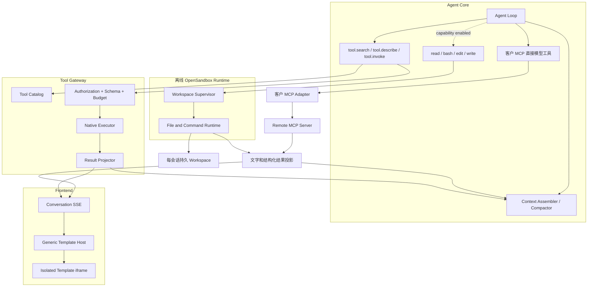

# Agent、自有 Tool Discovery、客户 MCP、Tool Template 与持久 Workspace

本架构已于 2026-09-13 同步 [已确认决策](./02-confirmed-decisions-and-open-questions.md) Q1～Q16。首期客户 MCP 仅 Remote Streamable HTTP，超容量运行前拒绝，业务文件上传/产物下载纳入正式范围。当前运行链路已按新基线切换；最新 R12/R13 修复和 P5 验收见 [修复记录](./fixes-r12-r13-2026-09-22.md)。真实中文模型评测仍未运行，整体不能标为全量完成。

## 1. 背景（立项时状态）

以下描述 PlanV5 立项时的旧实现，不代表当前代码状态。彼时已具备持久化 Run、模型调用、Tool Registry、Tool Result Projection、ContextSnapshot、PendingAction 和 OpenSandbox 生命周期管理，但运行时边界偏重：

- Agent 从完整 Registry 构造模型 Tool Catalog，再通过关键词和工具名启发式选择最多八个 Tool。
- 自有业务 Schema 随最多八个候选进入请求；总 Catalog 增长未必线性增加实际 Schema Token，但启发式筛选会影响可发现性与选择准确性。新方案同时验证任务成功率、总 Token 和有效结果延迟。
- Provider 内部消息只有普通 `role + content`，ToolCall 和 ToolResult 被转换为文本消息，不能稳定利用原生 Tool Calling 上下文和供应商缓存。
- ContextProjection 已被计算，但当前模型请求仍直接使用组装前的消息；会话历史查询也以当前 Run 为边界，不能完整恢复跨 Run Conversation。
- Card 领域同时承担模板目录、AI 创建、版本、验证、选择、渲染计划、实例、Presentation、Slot 和 Binding，Agent 还包含 Card 命令和 `card.render` 特殊路径。
- 当前 OpenSandbox Adapter 只管理 Backend、Profile、配额和 Session 生命周期，没有文件操作、命令执行或 stdio 子进程桥接。

历史入口（保留目录中的代码已按 PlanV5 重写）：

- [`internal/agent/loop.go`](../../internal/agent/loop.go)
- [`internal/agent/context.go`](../../internal/agent/context.go)
- [`internal/integration/modelprovider/provider.go`](../../internal/integration/modelprovider/provider.go)
- 原 `internal/card/` 已删除，不保留兼容入口。
- [`internal/integration/opensandbox/client.go`](../../internal/integration/opensandbox/client.go)
- [`internal/sandbox/service.go`](../../internal/sandbox/service.go)

PlanV5 重新确定 Agent Core、自有 Tool Gateway、客户 MCP Adapter、Presentation Runtime 与 Sandbox/Workspace Runtime 边界；核心通过通用模型工具调度接口组合它们，不感知业务和传输细节。

## 2. 目标与非目标

### 2.1 目标

1. Agent Core 保持单循环、稳定核心工具和确定性上下文拼接；客户 MCP 工具可额外直接进入模型。
2. 自有 Tool 通过分类搜索、详情查询和统一调用按需进入上下文；客户 MCP Tool Schema 直接注册。
3. 自有 Tool 定义、输入 Schema、执行器、模型投影和模板资产保持高内聚；客户 MCP 只消费数据。
4. Agent 不参与模板选择、模板生成、模板绑定或前端渲染。
5. OpenSandbox 是可选执行能力，不成为 Agent 服务启动和就绪的硬依赖。
6. 四基础工具在无网络的 OpenSandbox 中自由执行；首期客户 MCP 由服务端 Remote Adapter 联网调用，stdio 延后。
7. 自有工具保留授权、PendingAction、Approval、Execution、幂等和审计；客户 MCP 暂定直接执行，不附加自有 Preview/Commit。
8. 上下文按事件顺序追加，并在完整 Turn 边界执行增量压缩。
9. 为后续 MCP 和通用 Skill 保留清晰扩展边界，不扩大 Agent Core。
10. 每会话完整工作目录持久保存最新状态，计算实例回收不删除文件；明确删除才清理，满额不自动删文件。

### 2.2 非目标

- 客户 MCP 首版采用企业管理员配置/授权、用户按会话显式选择，仅支持 Remote Streamable HTTP；个人连接、stdio、旧双端点 HTTP+SSE 与 Marketplace 均不在首期范围。
- 本计划不建设模板编辑器、模板市场、模板组件目录或 Card Skill 创建功能。
- 模型可以在离线 Sandbox 内自由编写和执行代码，但不能联网下载依赖或在 Worker 宿主执行。客户 MCP 启动配置来自已接入连接，不能由一次 Tool 参数任意替换命令、Endpoint 或镜像。
- 本计划不引入多 Agent、子 Agent 调度、向量记忆或跨 Conversation 自动记忆。
- 本计划不实现 Skill Marketplace、企业 Skill 编辑器或自动模糊激活；只固定未来接入契约。
- 本计划不让模板绕过服务端 API、RBAC、数据授权或 PendingAction 状态机。
- 本计划不要求兼容旧 Card 数据、Card API 或浏览器 localStorage 状态。
- Workspace 保存完整目录最新状态，不承诺每次文件修改回滚，也不把进程内存和连接恢复等同于文件持久化。

## 3. 总体架构



模型工具集合为 `CoreToolSet + ExternalMCPToolSet`：三个元工具始终存在，离线 Sandbox 可用时增加四基础工具，再追加本 Run 使用的会话所选客户 MCP 工具，总数为 `3 + 可选的4 + N`。会话显式选择已授权的企业连接并保存选择；所选连接的可用 Schema 直接进入模型，不经过三个元工具或自有模板路径。

## 4. Agent Core

### 4.1 Agent Loop

目标循环只保留：

```text
load conversation tail and active snapshot
→ assemble model messages, core capability and external MCP tool snapshot
→ call fixed model revision
→ persist assistant deltas and native tool calls
→ validate and dispatch exact visible model tool identity
→ persist native tool results
→ append results and continue / wait / finish
```

Agent Loop 不再包含：

- 业务 Tool 名称启发式选择。
- Card 命令分支、Card 草稿生成或 `card.render`。
- MCP 传输判断。
- Template 解析、Template Hash、展示选择或 iframe 协议。
- 直接访问 OpenSandbox Lifecycle API。
- Commit Tool 调用。

CoreToolSet 与 ExternalMCPToolSet 在调度边界组合；客户 MCP 使用连接标识和上游 Tool 标识生成确定性模型别名，防止同名覆盖核心工具或路由到自有隐藏 Commit。客户工具名中出现 `commit` 不等于获得 Argus Action Executor 身份。所有调用仍持久化原生 ToolCall/ToolResult。

### 4.2 模型可见工具

始终可见：

| Tool            | 用途                                            | 副作用          |
| --------------- | ----------------------------------------------- | --------------- |
| `tool.search`   | 在一个明确分类中检索可用业务工具                | 无              |
| `tool.describe` | 获取一个工具的描述、输入 Schema、风险和结果语义 | 无              |
| `tool.invoke`   | 调用已经确定的业务工具                          | 取决于目标 Tool |

条件可见：

| Tool    | 用途                            | 执行位置    |
| ------- | ------------------------------- | ----------- |
| `read`  | 读取当前 Sandbox Workspace 文件 | OpenSandbox |
| `bash`  | 在 Workspace 中运行受限命令     | OpenSandbox |
| `edit`  | 对已存在文件执行精确编辑        | OpenSandbox |
| `write` | 创建或覆盖 Workspace 文件       | OpenSandbox |

当 OpenSandbox 未配置、Capability Probe 失败、企业没有配额或找不到允许的 `agent_workspace` Profile 时，四个基础工具不进入本 Run 的模型 Tool 列表。Agent 不因此失败，也不得回退到 Worker 宿主环境。

客户 Remote MCP 的各个 Tool Schema 直接进入模型工具列表，模型无需 Search/Describe 即可调用，读写暂可直接执行，不套 Argus Preview/Commit。它独立于离线 Sandbox；连接端点和凭据在服务端，不作为模型参数。stdio 延后，本期模型工具集合不包含该执行路径。

### 4.3 上下文拼接

模型请求顺序固定为：

```text
system instructions
→ stable core tool schemas + enabled external MCP tool schemas
→ optional active context snapshot
→ uncompressed conversation tail
→ current user message
→ subsequent assistant tool calls and tool results
```

要求：

1. ToolCall 和 ToolResult 使用 Provider-neutral 原生消息类型，不转换成虚构的 assistant/user 文本。
2. 同一 Tool Batch 的调用和结果保持成组，Compaction 不能从中间切分。
3. 三个元工具、四基础工具和客户 MCP 的结果按实际调用顺序追加，不重排成目录快照；客户 MCP 文本/结构化结果作为不可信数据，不升级为系统指令。
4. 模型上下文只保存 Tool Result 的模型安全投影，Template 源码和完整 UI 数据不进入上下文。
5. 每条用户消息可以创建独立 Run，但 ContextAssembler 必须按 `conversation_id` 读取跨 Run 事件尾部。
6. 旧摘要只覆盖其明确的 Event Range；最近完整 Turn 和未完成动作永不被旧摘要替代。
7. 显式激活的 Skill Instruction 作为带版本和 Hash 的独立上下文块保留，不被 Narrative Summary 改写。

### 4.4 Compaction

Compaction 采用 Pi 风格的增量摘要与尾部保留，但 PostgreSQL Event Ledger 继续作为权威历史：

```text
previous snapshot summary
+ newly compacted complete turns
→ new narrative summary
+ server-generated active facts
+ recent complete tail
```

服务端事实只包含模型继续工作需要的内容，例如活动 `action_ref`、Execution 状态、目标资源引用和最近稳定错误；不在 Agent Harness 中维护复杂的模型计划状态机。PendingAction、Approval 和 Execution 仍从各自领域表重建，模型摘要不能覆盖。

## 5. Tool Catalog 与发现协议

### 5.1 分类与执行器正交

本节只定义 Argus 自有 MCP Registry。客户 MCP 不加入该 Catalog，不要求适配分类、内部 Commit 或模板协议。

`category` 是面向模型的业务分类，`executor` 是服务端执行路径，两者不得合并。

第一批分类：

```text
host
k8s
metric
trace
log
connector
workflow
```

新分类必须进入版本化枚举和契约测试，不能由单个 Tool 返回任意字符串。

执行器：

```text
native
```

第一版自有 Tool 使用 Native Executor，客户 MCP 仅使用独立 `remote_mcp_http` Adapter；未来内部实现变化不改变自有分类身份。四基础工具使用独立 Sandbox 接口，不注册为自有业务分类，`sandbox_stdio_mcp` 不在首期实现。

### 5.2 Tool Manifest

每个 Tool 使用代码内版本化 Manifest 注册：

```yaml
category: metric
name: query_range
version: 1
title: 查询指标时间序列
description: 按已授权资源和时间范围查询指标
keywords: [metric, timeseries, error-rate]
executor: native
risk: read
input_schema: {}
output_schema: {}
model_projection: metric.query_range/v1
required_permissions: [telemetry.metric.read]
availability: always
presentation:
  runtime: argus-template/v1
  asset: templates/query-range.html
  version: 1
```

Tool 身份是规范化的 `category + name`。分类与名称创建后不可改变语义；不兼容输入或输出变更增加 Manifest Version。

Manifest 不向模型暴露 executor 内部地址、命令、Secret、镜像、Profile 或网络配置。

### 5.3 `tool.search`

输入：

```json
{
  "category": "metric",
  "query": "错误率 时间序列",
  "limit": 10,
  "cursor": ""
}
```

约束：

- `category` 必填且必须是已知枚举。
- `query` 可以为空；为空表示列出分类内最相关的一页。
- `limit` 默认 10，最大 20。
- 只返回当前企业、用户权限和本 Run Capability Snapshot 可用的 Tool。
- 搜索匹配 Manifest 的名称、标题、描述和关键词，不搜索完整 Schema 或模板源码。
- 排序必须确定性，相同目录版本和输入产生相同结果与 Hash。

输出只包含发现所需摘要：

```json
{
  "category": "metric",
  "items": [
    {
      "name": "query_range",
      "title": "查询指标时间序列",
      "summary": "按资源和时间范围查询指标",
      "risk": "read",
      "requires_confirmation": false,
      "version": 1
    }
  ],
  "next_cursor": null,
  "catalog_revision": "..."
}
```

### 5.4 `tool.describe`

输入固定为：

```json
{
  "category": "metric",
  "name": "query_range"
}
```

返回标题、完整描述、输入 JSON Schema、输出语义、风险、权限前件、是否可能产生 PendingAction、版本和示例。它不返回模板源码、executor 地址或 Secret。

同一个 `category + name + version + authorization/capability snapshot` 必须产生确定性描述，便于模型上下文缓存和审计。

### 5.5 `tool.invoke`

输入固定为：

```json
{
  "category": "metric",
  "name": "query_range",
  "arguments": {
    "metric": "http.server.request.error_rate",
    "from": "2026-08-31T00:00:00Z",
    "to": "2026-08-31T01:00:00Z"
  }
}
```

Tool Gateway 必须重新执行：

1. 分类和名称精确匹配。
2. Tool 版本和启用状态检查。
3. Capability Snapshot 与 executor 可用性检查。
4. 用户、ServiceAccount、企业、功能权限和 explicit resource authorization。
5. 输入 Schema、时间范围、分页、资源数量和预算校验。
6. 风险、Preview/Commit 和 PendingAction 策略。
7. 幂等键、超时、取消和并发限制。
8. 完整结果持久化、模型投影和界面投影生成。

`tool.describe` 不是授权票据。即使模型刚获取过详情，`tool.invoke` 仍必须重新校验当前权限和资源版本。

Agent 行为协议要求对当前 Run 中尚未描述过的 Tool 先调用 `tool.describe` 再调用 `tool.invoke`。这用于避免模型猜测参数，不构成安全凭据；Gateway 不依赖这段调用历史授权执行。

## 6. Tool Result Envelope

### 6.1 双投影

自有调用只产生一个权威 ToolCall，并可返回两个受众投影。客户 MCP 则只生成模型/普通 Tool Trace 数据投影，绝不因其返回 HTML 或 Presentation 元数据进入 Template Host。

```json
{
  "tool_call_id": "tc_01...",
  "tool": {
    "category": "metric",
    "name": "query_range",
    "version": 1
  },
  "status": "succeeded",
  "model_result": {
    "summary": "payment 服务错误率在 00:35 后升高",
    "data": {
      "peak": 0.083,
      "baseline": 0.012
    },
    "resource_refs": ["service/payment"],
    "result_ref": "tr_01...",
    "partial": false
  },
  "presentation": {
    "template": {
      "media_type": "text/html",
      "runtime": "argus-template/v1",
      "version": "1",
      "sha256": "...",
      "source": "<html>...</html>"
    },
    "data": {
      "series": []
    },
    "action_refs": []
  },
  "error": null
}
```

处理规则：

- `model_result` 进入 Agent ToolResult Message 和后续 Compaction。
- `presentation` 通过 `tool_presentation` 会话事件/SSE 投影给前端。
- Envelope 中的公开 `action_refs` 仅由宿主动作控件消费；给 iframe 传输时只取模板、详情数据和结果/资源 Ref，不能将整个 Presentation 对象直接透传。
- Template 源码不进入模型消息、摘要、模型可见 Artifact 内容或日志。
- 完整原始结果按既有 Tool Result Store/Artifact 机制保存一次，并关联同一 `tool_call_id`。
- 历史会话渲染读取当次保存的 Template Artifact 和 Hash，不读取 Tool 当前版本重新解释旧数据。

### 6.2 大小边界

第一版基线：

| 内容                     | 上限    | 超限处理                             |
| ------------------------ | ------- | ------------------------------------ |
| 内联 Tool Result Artifact | 4 MiB | 超限使用独立大文件存储/受控引用接口，不能写入现有受限 Artifact 行 |
| Model Result Projection  | 64 KiB  | 确定性裁剪并标记 `partial`           |
| Template 未压缩源码      | 256 KiB | Tool 发布门禁失败                    |
| Presentation Inline Data | 1 MiB   | 当前结果采样或 `result_ref`；下一页由新消息/Tool Call 获取 |
| iframe Bridge 单条消息   | 1 MiB   | 拒绝并返回稳定错误                   |

后续允许前端按 `sha256` 缓存相同模板；缓存只是传输优化，Tool 仍是模板唯一来源，不建立模板 Catalog。

## 7. Tool 自带模板

### 7.1 所有权

Native Tool 将模板作为同一代码包内的只读资产，例如：

```text
internal/tools/metric/queryrange/
├── manifest.go
├── handler.go
├── projector.go
├── templates/query-range.html
└── contract_test.go
```

Go Tool 可以使用 `go:embed` 将模板编译进发布物。Tool 注册时校验 Manifest、Template Hash、Runtime Version、大小和 CSP 能力；调用成功后把模板与展示数据写入 Presentation Projection。

只有自有 Tool 提供模板和 Presentation Builder。客户 stdio/Remote MCP 一律仅消费文字/结构化数据，不建设 Argus Presentation Extension 适配，不为客户 MCP 配置或选择模板，不执行其 HTML、脚本或 Dashboard。非数据展示元信息忽略；支持的数据内容继续按正常 ToolResult 处理。

Tool 不需要模板时可以只返回 `model_result`，前端使用普通文本 Tool Trace。模板失败不能改写已经成功的查询或自有动作事实，须记录 `presentation_status=failed`。自有 Preview 的确认入口由宿主统一提供；模板加载失败时仍可展示服务端权威的公开影响范围和动作状态。只有宿主取得完整有效的公开预览且状态允许时才能确认，不能根据模板文字补造缺失内容或绕过真实用户确认。

### 7.2 Template Host

前端只保留一个通用 `ToolPresentationFrame` 和一个隔离 Runtime：

```text
Conversation Message
→ ToolPresentationFrame
→ isolated iframe / independent Origin
→ template source + presentation data + safe context
```

Template Host 负责：

- 校验 Runtime Version、Hash、大小和消息 Schema。
- 创建 sandbox iframe 和最小 CSP。
- 注入 `locale`、`color_scheme` 和 Argus design tokens。
- 通过一次性 nonce 和 `MessageChannel` 传输数据。
- 处理自动高度、销毁、错误占位和可访问性基线。
- 允许固定、版本化的安全动作消息。

Template Host 不负责：

- 查找、选择、编辑或保存业务模板。
- 识别某个 Tool 的字段语义。
- 把 Tool 数据映射到 Slot。
- 根据用户意图挑选卡片。
- 允许模板按名称调用任意 Tool 或 HTTP API。

它是安全渲染 ABI，不是模板组件库。宿主的通用 PendingAction 控件独立于模板 iframe，消费服务端公开动作投影；不在 Frame 内增加 Host/Kubernetes 等业务字段分支。

### 7.3 展示 Bridge 与宿主确认

模板只能获得服务端生成的公开引用：

```text
result_ref
optional open_resource_ref
```

第一版 Bridge 动作白名单：

```text
resize
open_resource
open_result
```

`action_ref` 与权威公开影响范围只由宿主动作控件消费，不作为 iframe 的提交能力。宿主统一显示影响范围、确认/取消按钮以及审批和执行状态，用户只确认一次；宿主用当前登录身份和 `action_ref + request_id` 调用固定 PendingAction API。服务端重新校验主体、动作状态、授权与资源版本。模板不提交确认/取消事件、Commit 参数、Tool 名称、Profile、Secret 或任意请求 URL。

查询刷新第一版不开放 `tools/call`、`refresh_ref` 或服务端分页 Bridge。翻页、修改时间范围及其他需要重新取数的操作，必须由用户在会话中再发消息触发新 Tool Call。已有数据的本地折叠/展开不产生新查询。

iframe 发送 `confirm_action/cancel_action` 或试图改写宿主影响范围时一律拒绝。模板只展示业务详情，其加载/样式不决定最终确认入口。客户 MCP 没有展示模板，也不走这一确认流程。

## 8. PendingAction 与写操作

PlanV5 删除 Card 专属 Action Binding，但自有业务工具保留两阶段操作；客户 MCP 读写暂定直接执行，不创建 Argus Preview/Commit 对。

```text
tool.invoke(*.preview)
→ Preview Tool 冻结计划和私有一次性 Token
→ Tool Result 返回 model_result + 自有详情 template + 宿主公开动作投影
→ 用户在宿主统一控件中确认一次
→ PendingAction / Approval / Execution
→ Action Executor 调用隐藏 Commit Tool
→ 确定性执行结果持久化
→ Agent 可继续进行已授权的只读验证与总结
→ 若需要新的自有变更，重新生成 Preview
```

安全不变量不变：

- Commit Tool 永不进入三个元工具的可发现目录。
- `argus__token`、冻结参数和生产凭据不进入浏览器、模板或模型上下文。
- Template 只展示公开 Preview 数据，不是授权或执行主体。
- 用户确认后的提交完全确定性执行，不交给模型重新决定参数或是否提交；执行后允许 Agent 只读验证、总结。再次自有变更使用新 Preview。
- Approval 不能补齐缺失的基础权限。
- Execution 幂等、ResultUnknown 对账和一次性结果领取继续使用现有服务端状态机。

客户 MCP 的结果记录不冒充 Argus Execution。外接调用超时/回执丢失不能自动声称操作失败或成功，亦不能仅因客户端重试就假定上游幂等。自动验证阶段只允许已知只读能力，不能因客户 MCP 在普通运行中可直接写入而把它当作只读验证工具。

## 9. OpenSandbox 可选能力

### 9.1 Capability Snapshot

每个 Run 启动时生成并持久化核心能力快照和实际采用的客户 MCP 工具集合：

```json
{
  "offline_workspace_runtime": {
    "status": "ready",
    "backend_id": "...",
    "backend_version": 3,
    "profile_id": "...",
    "profile_revision": 7,
    "image_id": "...",
    "image_version": 2,
    "image_digest": "sha256:...",
    "workspace_kind": "agent_workspace"
  },
  "external_mcp_connections": [],
  "external_tool_schema_hash": "...",
  "catalog_revision": "..."
}
```

状态：

```text
ready
not_configured
unhealthy
profile_unavailable
quota_unavailable
```

只有离线执行能力 `ready` 才暴露四基础工具。客户 Remote MCP 单独记录连接能力，由 ExternalMCPToolSet 暴露，不通过 `tool.search`，也不依赖离线 Workspace。某一类不可用不使其他路径或 Agent Worker Readiness 失败；本期没有 stdio 能力项。

运行前绑定 Profile ID/revision、Backend ID/version、Image ID/version/digest，执行和 admission 再核对固定身份，失效返回 `TOOL_VERSION_UNAVAILABLE`，不重选新版。运行中命令已发送却未取得权威终态时，记录 `SANDBOX_COMMAND_RESULT_UNKNOWN` 并停止自动推进；不在流式 ModelCall 中途改变 Schema。Run 快照保留当时版本，恢复时另做实时健康/撤权检查，不覆盖原快照；新 Run 重建快照。外接 Schema 版本改变时不得默默按新定义执行旧调用。

### 9.2 Workspace 生命周期

每个会话独立拥有持久 Workspace，身份使用：

```text
enterprise_id + conversation_id + workspace_id
```

Workspace 与计算实例分别管理。完整工作目录的最新状态由独立持久存储保存；计算实例使用空闲 TTL/总运行时长限制，回收后新实例挂载原目录。关闭页面、结束 Run、长期未使用和归档均不删除文件。只有明确删除 Workspace 或永久删除会话才进入数据清理；明确删除后的后续会话如需工作区必须建立新的身份，不能恢复已删除内容。

健康计算 Pod 可在默认 15 分钟空闲窗口内复用，租约接管通过受信 Supervisor 和固定文件 RPC 排空旧请求、撤销旧用户进程后换绑 fence。Supervisor 为 UID 10001，仅管理进程拥有 SETUID/SETGID/KILL；用户 UID >=100000，全部能力清零、禁止提权、看不到管理证书。每次命令结束清理所有用户后台进程，热复用只保留计算实例和工作目录，不承诺保留任意进程。无法证明排空时必须物理撤销旧 Pod。实例续期在数据库配额锁内预留新增计算时间。

第一版不承诺逐次修改回滚。保存文件树不等于保存进程、内存、连接或任意容器系统盘；用户脚本和分析文件随目录保存，语言及分析依赖由固定预装镜像提供。达到存储额度时停止新增写入，不自动删旧文件；读操作与不增加占用的显式清理仍可进行，任何通过 `bash` 的写入也须受同一存储额度约束。

PostgreSQL 保存 Workspace 归属、存储引用、容量、状态和计算实例关联，文件内容使用持久卷等独立存储。挂载引用和路径由服务端决定，模型不能指定其他租户的存储。同一工作区写入用 Lease/Fence 协调。文件成功回执必须与持久存储语义对齐，不能只依赖 Run 结束时临时打包。

首期 Remote MCP 不共享离线 Workspace 的执行环境或持久卷，也不会因“同一会话”自动取得整个目录。需要发送给客户工具的数据由已启用工具的显式参数/受控数据路径提供；不得把 Workspace 存储凭据交给模型或客户 MCP。未来 stdio 隔离策略见后续范围。

### 9.3 Sandbox Tool Proxy

现有 OpenSandbox Lifecycle Client 需要扩展或配套一个执行代理，至少支持：

```text
ensure workspace
attach persistent workspace
release compute instance without deleting workspace
exec command
read file
write file
apply edit
start supervised process
send stdin / receive stdout-stderr
cancel process
list and terminate processes
upload/download controlled artifact
delete workspace only on explicit lifecycle request
```

Agent 执行调用必须有 `enterprise_id/conversation_id/run_id/tool_call_id/workspace_id`、计算实例代次、超时和预算。用户上传/下载及 Workspace 管理调用使用当前主体、企业/会话/Workspace 和请求 ID，不要求存在 Run、ToolCall 或活跃计算实例，不为文件传输编造模型调用。路径以 Workspace Root 为根，拒绝逃逸、Worker 宿主挂载与设备文件。离线执行环境禁止出站网络；传输结果和文件由受控服务端通道完成，不给 `bash` 暴露网络代理。

本期必须补齐“大结果引用/用户业务文件 → Workspace 文件 → 离线分析 → 会话下载”的工具与文件契约。现有 Tool Artifact 单项 4 MiB，不能直接作为完整目录仓库；大文件传输、限额与当前数据授权在独立文件接口落实，模型可调用接口在详细设计中固化，不增加第八个核心工具。

### 9.4 会话业务文件上传与产物下载

- 用户在当前会话选择业务文件后，服务端真实接收、校验并写入该会话的持久 Workspace；只有持久化完成才显示上传成功，不能只保存文件名。
- 消息关联已经完成上传的文件引用与安全工作路径，模型通过 `read/bash` 分析。文件正文不自动全量注入 Prompt，上传不授予出站网络或依赖安装能力。
- 上传使用容量预留、大小限制、路径规范化和原子提交；失败、中断或满额不产生可用附件，不覆盖原文件，不通过静默删旧文件腾空间。
- 模型生成文件后，由服务端验证其属于当前 Workspace，再保存受控交付引用和名称/大小/内容 Hash，在会话提供下载。不能仅返回容器路径或模型编造 URL。
- 下载重新校验企业/会话权限，服务端传输文件；交付引用绑定明确内容，之后工作目录同名文件被修改不改变已交付内容。这是交付产物的一致性，不提供 Workspace 逐次修改回滚。
- 文件能力与计算生命周期分开；实例回收、刷新页面和后续 Run 不应导致已交付文件失效。文件存储不可用时明确显示原因，不阻断普通对话、自有查询或 Remote MCP。
- 上传/下载控件复用 Enterprise 组件、i18n 和主题规范；本期交付会话附件与产物入口，不默认扩展为完整 IDE 或文件编辑器。

## 10. MCP 边界

### 10.1 后续范围：stdio MCP

stdio 明确延后，不建设首期配置入口、客户程序启动、联网 Sandbox、Supervisor 协议适配或 E2E 门禁。当前连接契约拒绝不支持的传输，不保存为一个看似可执行的 stdio 连接。

未来若接入，须另行设计独立可联网的 OpenSandbox 运行时、进程/凭据隔离、工具发现与结果回收；不能在 Worker 宿主执行，也不能与离线四工具共享网络权限。此处只保留后续边界，不要求本期实现。

### 10.2 Remote MCP

首期只交付客户 Remote Streamable HTTP Adapter，企业管理员配置连接/授权，用户按会话显式选择。协议与执行约束如下：

- 服务端 External MCP Adapter 作为 Client 调用远程 Streamable HTTP Endpoint，模型直接使用该连接暴露的工具。
- 支持 Streamable HTTP 的 JSON 与可选 SSE 响应；旧双端点 HTTP+SSE 不在首期范围，不提供自动降级兼容。
- 在生成模型工具集合前完成 `initialize/tools/list` 或读取有效版本快照；规范化工具名/Schema并记录版本，不能将尚未发现的工具视作已注册。
- Endpoint、认证和企业归属作为企业连接事实保存，TLS、协议和平台隔离边界在服务端实施；凭据只写入受保护存储，普通用户/模型不读取原值。
- 浏览器和模板不直接连接远程 MCP。
- 远程读写 Tool 暂可直接执行，不套 Argus 自有 Preview/Commit；结果生成原生 ToolResult 和普通 Tool Trace 数据投影。
- 不消费远程 MCP Presentation Extension，不向 Template Host 下发远程模板或 Dashboard。

### 10.3 企业 MCP 管理与会话选择

- 企业管理员创建、修改、测试、启停企业 MCP 连接，配置凭据并授权本企业成员使用；首版没有个人 MCP 连接，平台管理员不代管企业连接凭据。
- 普通用户只查看和选择已获授权连接。会话保存显式选择的连接 ID，新连接不自动加入已有会话；管理连接不会自动为任何会话启用它。
- 每次 Run 从会话选择与当前连接授权/启用状态生成实际工具集合，将所选连接的可用工具直接提供模型。运行前检查所选模型的工具/上下文容量；不足时明确提示减少连接或更换模型，不启动本次 Agent 执行，不改走三个元工具、不静默裁工具、不自动换模型。
- 预检由服务端使用本次实际 Schema、必要系统/用户上下文与输出预留完成，前端估算不能替代最终校验；失败时保留消息草稿、已上传文件和连接选择。历史可压缩不等于工具 Schema 容量无限。
- 每次实际调用前检查最新授权和启用状态，撤权/停用立即阻止后续执行，不能因为 Run 保存旧 Schema 而继续调用。已送达上游的请求不能假称撤销后从未执行；取消和结果记录按协议实际能力处理。
- 用户调整会话连接选择影响后续 Run；不在进行中的流式 ModelCall 中途修改 Schema。服务端撤权/停用仍立即生效，与用户选择快照分开。
- Enterprise 管理页、会话选择器与 API Client 复用项目统一组件、权限与中英文/明暗主题规范，不把底层 Sandbox Profile 配置放进企业 MCP 表单。

### 10.4 Skill 扩展边界

后续通用 Skill 不增加新的模型 Tool，也不拥有执行器或模板。Skill 是服务端解析并显式激活的版本化上下文包：

```yaml
name: telemetry_incident_analysis
version: 1
description: 按指标、日志和 Trace 证据分析故障
activation: explicit
instructions: skills/telemetry-incident-analysis.md
allowed_categories: [metric, log, trace, k8s]
```

约束：

- 用户通过明确 `/skill`、产品命令或受信业务入口激活；第一版不让模型在全量 Skill Catalog 中模糊自选。
- ContextAssembler 只加载本 Run 激活的 Skill Instruction，并保存 Skill Version/Hash；不把全部 Skill 注入 System Prompt。
- Skill 对自有业务工具仍指导三个元工具，不能调用隐藏 Commit；是否指导离线代码和已有客户 MCP 工具继续细化，Skill 不负责外接工具注册。
- Skill 不能携带 Template、DOM 代码、Secret 或接管 Endpoint/Sandbox Profile 配置；离线代码示例与已有 MCP 工具的指导范围待细化，不将“禁止任意命令”扩展为禁止四基础工具已获允许的自由代码。
- 自有业务可执行能力仍成为 Gateway 管理的 Tool，自有富展示仍由目标 Tool 提供；离线代码与客户 MCP 不因 Skill 指导而改为自有业务注册或模板路径。
- Skill Instruction 是不可信扩展上下文，优先级低于系统安全策略，不能改变权限、预算、Tool Visibility 或 PendingAction 规则。

PlanV5 只固化 `SkillManifest + ActiveSkillContext` 接口和 Context Hash，不建设 Skill 管理 UI、市场或远程安装。

## 11. 安全边界

### 11.1 模板

- 默认 `connect-src 'none'`，禁止模板直接访问网络。
- 使用独立 Origin 或严格 sandbox iframe；禁止读取宿主 DOM、Cookie、localStorage 和 API Client。
- 脚本只允许模板发布物内的受控内容，禁止动态代码下载和 `eval`。
- Host 与 iframe 通过精确 Origin、nonce、单调序号、大小限制和版本化消息通信。
- 模板错误只影响本次展示，不得改写 Tool Result、PendingAction 或模型上下文。

### 11.2 Sandbox

- 禁止 Worker 宿主执行 fallback。
- 离线四工具无生产 Secret、无 Worker 宿主文件系统、无 Connector/RemoteAccessTicket、无 Kubernetes API。
- 离线代码环境网络为 `none`；客户 Remote MCP 由服务端 Adapter 联网，不能通过共享凭据或 Supervisor 控制通道给离线代码扩权。stdio 延后。
- CPU、内存、临时磁盘、PID、进程数、命令时长、输出和计算实例 TTL 受限；持久 Workspace 按容量约束，不设闲置删除 TTL。
- 所有镜像使用批准 Digest，模型不能选择 Profile 或扩大权限。
- 离线镜像预装常用语言和分析库，并记录可供模型查询的环境能力清单；缺少依赖时明确报错，不自动联网安装。本期不增加用户上传离线依赖包的安装流程，环境版本随运行镜像发布。

### 11.3 Tool Gateway

- `tool.search` 的隐藏不等于授权；每次 `describe` 和 `invoke` 都重新投影。
- 搜索结果不得泄漏用户无权知道的资源、工具或连接配置。
- Tool 输入和远端结果都是不可信数据，不能升级为 System Instruction。
- 自有业务变更继续 Preview/Commit，隐藏 Commit 仅允许 Action Executor 内部身份；客户 MCP 不经过自有 Gateway，也不能冒充其内部身份。

## 12. 可观测性

每次 ModelCall 和 ToolCall 至少记录：

- 核心 Tool Schema Revision、Capability Snapshot Hash、Catalog Revision。
- 外接连接/上游 Tool 身份、直接注入的 Schema Hash、工具数量与额外 Schema Token。
- Search/Describe/Invoke 分类、目标 Tool Version、搜索命中数和描述缓存命中。
- executor、排队、执行、投影和 Presentation 构建耗时。
- 原始结果、模型投影、Presentation Data 和 Template 字节数。
- Workspace ID、持久存储用量、计算实例代次、Profile Revision 和进程结果；区分实例回收与明确删除，日志不得包含文件正文或 Secret。
- Remote MCP 初始化、会话、协议错误和取消原因；工具容量预检结果、上传/下载状态与文件大小/Hash，不记录业务文件正文或凭据。
- Template Runtime Version、Hash、加载/渲染失败和 Bridge 拒绝原因。
- Compaction 前后 Token，以及 search/describe/invoke 结果占用。

## 13. 删除和迁移范围

### 13.1 后端

删除或重构：

- `internal/card/*`
- `internal/agent/card_command.go` 及测试
- `card.render` 注册和 Agent 特殊选择逻辑
- Card HTTP Handler、OpenAPI generation、Schema 和生成代码
- Card Catalog、CardVersion、CardInstance、CardPresentation、Slot、Binding、Demo、Validation 数据访问
- Card Runtime 专用 Runtime Task 和系统目录同步

保留：

- PendingAction、Approval、Execution、Action Executor 和一次性 Token。
- Tool Result Store、Artifact、ConversationEvent 和 SSE。
- iframe 安全握手中可复用的通用实现，但重命名并删除 Card/Slot/Binding 语义。

### 13.2 前端

删除：

- 交互卡片设置页和路由。
- 会话 `/创建交互卡片` 命令。
- 内置/企业 Card 列表、预览、Demo 和 Binding UI。
- Card API Client、Mock 数据和 localStorage 状态。
- `CardPresentation`、Slot/Binding 协议和 Card 选择逻辑。

替换：

- `sandbox-card-frame` 替换为通用 `ToolPresentationFrame`。
- `@argus/card-host` 和 `web/apps/card-runtime` 收敛为无业务模板目录的 Presentation Host/Runtime；也可以在引用迁移完成后按新的包名重建。
- 宿主 PendingAction 控件关联同次 Tool Result 的公开动作投影与 `action_ref`，统一负责影响范围、确认/取消和状态；模板 iframe 只消费详情数据，状态查询继续使用正式 API。

### 13.3 数据库和契约

项目未发布，不保留 Card 数据兼容层：

- 从权威 Schema 中删除 Card Catalog、Version、Instance、Presentation、Slot 和 Binding 表及查询。
- 删除 Card API/OpenAPI/JSON Schema/Bridge Rules 和生成代码。
- Tool Result/Conversation Event 增加 Presentation Artifact、Template Hash/Version、Projection Status 和受众字段。
- Run/ModelCall 保存 Capability Snapshot Hash 与核心 Tool Schema Revision。
- 增加 Workspace 独立生命周期与计算实例关联，以及客户 MCP 工具身份/Schema 快照；工作目录不存进现有单项 4 MiB Tool Artifact。
- 干净数据库和临时 E2E Namespace 从新基线创建，不提供 Card 数据迁移或双读。

## 14. 故障语义

| 条件                 | 行为                               | 稳定错误                    |
| -------------------- | ---------------------------------- | --------------------------- |
| 未知 Tool 分类       | 元工具拒绝，不模糊猜测             | `TOOL_CATEGORY_UNKNOWN`     |
| Tool 不存在或不可见  | 不泄漏存在性                       | `TOOL_NOT_FOUND`            |
| 参数不符合 Schema    | 不执行目标 Tool                    | `TOOL_INPUT_INVALID`        |
| Tool 权限撤销        | 重新校验并拒绝                     | `TOOL_FORBIDDEN`            |
| OpenSandbox 未配置   | 排除相关工具，Agent 继续           | 无 Run 级错误               |
| Sandbox 运行中不可用 | 当前调用失败，后续刷新能力         | `SANDBOX_UNAVAILABLE`       |
| Remote MCP 协议损坏 | 拒绝无效响应，记录受控调用错误      | `MCP_PROTOCOL_ERROR`        |
| Remote MCP 超时      | ToolCall 可重试性由风险决定        | `MCP_UPSTREAM_TIMEOUT`      |
| Template 构建失败    | 详情降级；宿主按有效公开预览继续显示确认/状态，不绕过确认 | `TOOL_PRESENTATION_FAILED` |
| Template Host 拒绝   | 显示安全错误占位                   | `TEMPLATE_RUNTIME_REJECTED` |

错误响应必须经过安全投影，不回显命令、Endpoint、Secret、内部网络、模板源码或上游未裁剪错误正文。

## 15. 验收标准

1. 无 OpenSandbox 的安装中，自有三个元工具与 Remote MCP 正常，四基础工具不出现；stdio 在所有首期安装模式都不可配置/执行。
2. OpenSandbox 可用时，四个基础工具共享同一 Workspace，`write → read → bash → edit` 在多轮对话中保持一致文件状态。
3. 自有 Catalog 增长到至少 500 个模拟 Tool 时核心 Schema 不增长；客户 MCP 工具直接注册并单独计量，模型工具总数为 `3 + 可选的4 + N`。
4. Tool Search、Describe 和 Invoke 结果以原生 ToolResult 顺序进入下一轮，并能命中稳定上下文前缀缓存。
5. Template 源码在模型请求、Compaction 输入、摘要和 Tool Trace 文本中均不可检出。
6. 指标、日志、Trace、Host、Kubernetes 和 Connector 至少各有一个 Tool 自带模板真实渲染。
7. Template 无法访问主应用 DOM、Cookie、localStorage、任意网络或任意 Tool。
8. 自有 Preview 由宿主统一展示影响范围、确认/取消和审批执行状态，用户只确认一次；模板发送确认消息无效，浏览器和模板无法获得私有 Commit Token 或冻结参数。
9. OpenSandbox 故障、配额耗尽和 Profile 缺失不影响 Agent/Native Tool Worker Readiness。
10. Worker 宿主不执行用户代码；本期不存在客户 stdio 进程启动路径，Remote MCP 不依赖离线 Sandbox。
11. 删除所有 Card Skill、Card API、Card 管理页面、Card 表和 `card.render` 后，前后端构建、契约生成和 E2E 全部通过。
12. 完整 Kubernetes E2E 使用临时 Namespace，显式删除本次测试 Workspace/会话后清理其 Namespace、进程、Artifact Fixture、PVC 和 Lease，恢复被暂停的正常测试服务。
13. 客户 MCP 可直接执行并返回文字/结构化结果，不调用自有三个元工具，不生成 Preview 或模板。
14. 离线代码不能联网；客户 MCP 可联网，其故障与权限不影响离线环境或自有路径。
15. 工作目录写入后回收计算实例，新实例仍可读取相同文件；闲置/归档不删除，满额停止新增写，明确删除才清理。
16. 自有确定性提交后 Agent 可只读验证/总结，新的自有变更生成新 Preview；翻页和改时间都由新消息触发。
17. 企业管理员管理 MCP 连接/凭据/成员授权，用户按会话显式选择；新增连接不自动启用，撤权或停用立即阻止后续执行。
18. 离线镜像预装语言/分析库并可报告其能力；缺依赖不触发联网或新增上传依赖安装流程。
19. 工具 Schema 超容量在运行前明确拒绝；调整连接/模型后可重试，过程中无静默工具丢弃或模型切换。
20. 真实上传业务文件 → 模型离线分析 → 会话下载产物 → 刷新/实例回收后再次下载，权限、持久性与内容 Hash 均正确。

## 16. 需要同步更新的主文档

实施完成时至少更新：

- `docs/README.md`
- `docs/00-decisions-and-invariants.md`
- `docs/01-product-and-architecture.md`
- `docs/04-agent-mcp-and-action-workflow.md`
- `docs/05-tool-templates-and-host-ui.md`（删除或改写为 Tool Presentation Runtime）
- `docs/06-security-and-mvp-roadmap.md`
- `docs/08-model-and-sandbox-management.md`
- `docs/10-service-components-and-kubernetes-deployment.md`
- `docs/12-technology-stack-and-code-structure.md`
- `docs/13-current-implementation-and-kubernetes-rollout.md`
- `docs/15-end-to-end-implementation-plan.md`
- `docs/16-agent-harness-and-context-management.md`
- `docs/plans/M4-action-agent-workflow.md`
- M5 Card 相关计划和完成状态
- `docs/planv2/` 中依赖 Card Runtime 的 Dashboard 预览/分析计划；Dashboard 持久业务域不随 Card 删除

PlanV5 完成后，旧文档不能继续宣称 Tool 只返回数据、Card Skill 负责选择渲染、用户可以创建交互卡片或完整安装必须具备 OpenSandbox 才能运行 Agent。

### OpenSandbox 部署归属

固定版本上游 Controller 继续由上游 chart 提供；Argus 的 `argus-sandbox` chart 管理 server Deployment、配置、Service 和命名空间 Role。上游 server chart 未提供所需模板文件挂载，因此不再部署该 subchart。Argus 显式挂载 `batchsandbox.yaml`，只使用 template 模式；动态 PVC 经类型化 API 传入，并在 Pod 创建 admission 中验证。此变更不会引入新的服务进程或绕过上游运行时 API。

Workspace 使用独立 RawFile LocalPV 0.15.1，关闭快照、扩容及非必要 API Server；StorageClass 固定 thick/ext4/nodiscard/WaitForFirstConsumer。默认存储目录为 `/var/local/argus-workspaces/data` 和 `/var/local/argus-workspaces/meta`。生产必须将这些目录放在专用持久磁盘上，不能宣称跨节点高可用。
