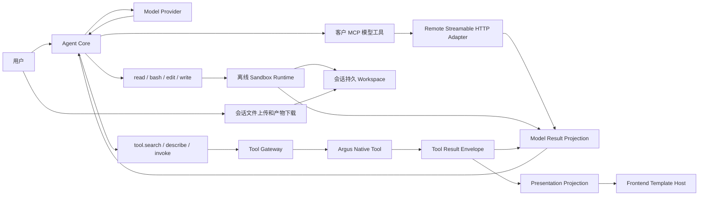

# PlanV5：小内核 Agent、自有 Tool Gateway、客户 MCP 与持久 Workspace

## 目标

PlanV5 重构当前工作台 Agent、Tool 发现机制和 Card Skill。Agent Harness 保持单循环小内核，通过通用工具调度接口使用三类能力：Argus 自有工具的三个元工具、离线 Sandbox 的四个基础工具、直接提供给模型的客户 MCP 工具。业务治理、MCP 传输、持久 Workspace 和界面渲染由独立边界承担。

2026-09-13 已确认的讨论结论见 [已确认决策与待决问题](./02-confirmed-decisions-and-open-questions.md)。以下为目标设计，不表示代码已经实现。模型工具集合为：

```text
始终存在：仅访问 Argus 自有 MCP Registry
├── tool.search
├── tool.describe
└── tool.invoke

离线 Sandbox 可用时存在：无网络，可自由处理文件和执行代码
├── read
├── bash
├── edit
└── write

客户 MCP 接入并对本次运行可用时存在
└── 客户 MCP 提供的各个模型工具（直接注册，数量为 N）
```

`host`、`k8s`、`metric`、`trace`、`log`、`connector` 等自有业务工具统一注册在 Argus MCP Registry 中，模型按分类 Search → Describe → Invoke，不直接注入其完整目录。自有变更继续 Preview/Commit，并可返回 Tool 自有模板。三个元工具在服务端执行，不受离线 Sandbox 的网络限制。

客户 MCP 不进入上述三个元工具或自有 Registry，不要求 Argus 分类、Preview/Commit 或展示模板。其 Tool Schema 直接注册为模型工具，由模型直接选择调用，读写暂定均可直接执行。结果仅按文字/结构化数据进入原生 ToolResult；不渲染客户 MCP 的 HTML、Dashboard 或 Presentation Extension。自由执行不改变企业隔离、连接凭据保护、协议校验、额度与审计边界。

首期客户 MCP 只支持 Remote Streamable HTTP，包含该协议的 JSON/可选 SSE 响应；stdio 和旧双端点 HTTP+SSE 留到后续，不进入本期配置入口、运行组件或验收门禁。

首版由企业管理员配置企业 MCP 连接、凭据并授权成员使用；普通用户在会话中显式选择自己已获授权的连接，选择随会话保存。所选连接的可用工具直接提供给模型，新增连接不自动加入已有会话，撤权或停用立即阻止执行。平台管理员只维护底层运行环境，不代管客户业务凭据，不默认建设个人 MCP 连接。

因此模型工具总数为 `3 + 可选的4 + N`，不再承诺总数只有三个或七个。自有 Catalog 扩容不增加初始核心 Schema Token；客户 MCP 的直接 Schema 成本必须另外计量。

运行前检查所选模型的工具/上下文容量；不足时明确提示用户减少所选连接或更换模型，不执行本次 Agent Run，不静默丢弃工具、不自动更换模型。错误提示保留当前输入、文件和连接选择。

每个需要富展示的自有 Tool 自己保存并发布模板。平台删除 Card Skill、Card Catalog、Card 列表、Card Slot、Card Binding、`card.render` 和会话创建卡片功能。Agent 不读取、选择或生成模板。查询翻页、改变时间范围等重新取数操作由用户再发消息触发新 Tool Call，不建设模板查询刷新/分页 Bridge。

自有模板只展示业务详情；宿主统一提供影响范围、确认/取消按钮与审批执行状态，用户只确认一次。模板不拥有最终确认入口，也不能通过 iframe 消息触发确认/取消。离线镜像预装常用语言和分析库，本期不增加用户上传依赖包的安装流程，不因缺依赖自动给 Sandbox 开网。

每个会话有独立持久 Workspace，保留完整工作目录的最新状态，不承诺每次修改可回滚。关闭页面、结束 Run、闲置、归档和 Sandbox 实例回收均不删除工作文件；只有明确删除 Workspace 或永久删除会话才清理。达到存储额度时停止新增写入，不自动删除旧文件。

用户可以将业务数据文件上传到当前会话 Workspace，模型通过离线工具读取分析；模型生成的文件在会话中提供可下载的交付项。上传必须传输真实文件，下载由服务端按企业/会话授权提供，不能只记录文件名或输出不可访问的容器路径。

后续通用 Skill 作为显式激活、版本化的上下文包接入，不自行注册工具。自有业务能力仍通过三个元工具，客户 MCP 由独立连接机制提供；Skill 不拥有模板、执行器或权限。Skill 对离线代码与客户 MCP 的具体指导范围继续讨论，不把旧的“只能使用三个元工具”写成全局限制。

## 最终运行链路



## 文档

| 文件                                                                               | 内容                                                                                       |
| ---------------------------------------------------------------------------------- | ------------------------------------------------------------------------------------------ |
| [01-agent-tool-template-architecture.md](./01-agent-tool-template-architecture.md) | 总体架构、协议、上下文、Tool Manifest、Template Host、安全边界、OpenSandbox 和迁移删除范围 |
| [02-confirmed-decisions-and-open-questions.md](./02-confirmed-decisions-and-open-questions.md) | 本轮已确认的产品契约、设计树和仍待回答的问题；不把建议写成已决策事项 |
| [task-01-agent-core-and-context.md](./task-01-agent-core-and-context.md)           | Agent Loop、原生 Tool 消息、跨 Run 上下文和 Compaction 重构                                |
| [task-02-tool-discovery-and-gateway.md](./task-02-tool-discovery-and-gateway.md)   | 自有 Registry 的三个元工具、分类目录、Tool Gateway、权限和结果投影 |
| [task-03-tool-owned-template-runtime.md](./task-03-tool-owned-template-runtime.md) | Tool 自带模板、Template Host、SSE 投影、动作桥接和首批工具迁移                             |
| [task-04-opensandbox-and-mcp.md](./task-04-opensandbox-and-mcp.md)                 | 离线四工具、持久 Workspace、客户 MCP 直接模型工具和独立传输边界 |
| [task-05-card-removal-and-cleanup.md](./task-05-card-removal-and-cleanup.md)       | 删除 Card Skill、Card 领域、前后端入口、契约、数据库对象和旧运行路径                       |
| [task-06-e2e-and-documentation.md](./task-06-e2e-and-documentation.md)             | 单元、契约、浏览器、临时 Kubernetes Namespace E2E、故障降级和主文档收口                    |

实施与使用文档：[最新修复与验收](./fixes-r17-2026-09-23.md)、[R17 发现记录](./review-2026-09-23-r17.md)、[R16 修复与验收](./fixes-r16-2026-09-23.md)、[R09～R11 修复与验收](./fixes-r09-r11-2026-09-22.md)、[R09～R11 复核](./review-2026-09-22-r09-r11.md)、[R06～R08 修复与验收](./fixes-2026-09-22.md)、[此前复核](./review-2026-09-22.md)、[验收报告](./acceptance-report.md)、[实施记录](./implementation-status.md)、[开发手册](./developer-guide.md)、[运维手册](./operations-guide.md)、[使用手册](./user-guide.md)。

## 架构边界变化

PlanV5 明确替换以下既有架构：

1. 删除自有 Registry 的英文关键词候选选择器；以主体感知的三个元工具替代。现有最终候选最多八个，新方案收益要同时验证准确性、总 Token 和任务延迟。
2. 删除 Card Skill、`card.render`、Render Plan、Card Selection、Card Catalog、Card Version、Card Instance、Card Presentation、Data/Query/Action Slot 与 Binding。
3. 删除企业用户在会话中创建 Card Skill、自定义卡片列表和内置卡片列表的产品功能。
4. 自有 Tool 从“只返回业务数据、平台选择卡片”调整为“返回模型投影，并可附带自有模板”。客户 MCP 仅提供数据。
5. OpenSandbox 从完整安装的硬依赖调整为 Agent 的可选能力；未配置或不可用时只排除依赖它的工具，Agent 和其余 Tool 继续运行。
6. stdio MCP 延后，本期不实现客户进程启动或额外联网 Sandbox；未来如接入，仍禁止 Worker 宿主启动，并与离线四工具隔离。
7. 客户 MCP 首期仅通过服务端 Remote Streamable HTTP Adapter 直接提供模型工具，不经过自有 Tool Gateway 的分类/Preview/模板协议。
8. 自有 `category` 与内部执行器保持正交；客户 MCP 使用连接与上游工具身份，不强行映射为自有分类。
9. Workspace 持久目录与 Sandbox 计算实例分离，实例 TTL 不能用于删除会话工作内容。
10. 自有提交不经模型重新决策；执行后可进行只读验证和总结，新的自有变更重新 Preview。

这会改变 `docs/00`、`01`、`04`、`05`、`06`、`08`、`10`、`12`、`13`、`15`、`16` 及 M4/M5 计划中已经确定的 Agent、Card 和 OpenSandbox 边界。Task 06 必须同步更新这些主文档，不能让 PlanV5 与旧基线长期并存。

## 核心不变量

1. Agent Core 不理解具体业务 Tool、MCP 传输或模板内容。
2. 核心工具为三个元工具加可选四基础工具，客户 MCP 工具直接追加；总数为 `3 + 可选的4 + N`。
3. `tool.search` 和 `tool.describe` 必须显式提供分类；`tool.invoke` 必须同时提供分类、名称和参数。
4. Tool Template 源码永不进入模型上下文、Compaction 摘要或可被模型重新解释的正文。
5. 自有 Tool Result 的模型/界面投影共享 `tool_call_id`；客户 MCP 只有数据投影，不进入 Template Host。
6. 前端只有一个通用 Template Host；业务模板由 Tool 持有，不存在独立模板注册、选择、编辑或绑定系统。
7. 模板运行在隔离 iframe/Origin 中，默认无网络、无宿主 DOM、无 Cookie、无任意 Tool 调用能力。
8. 自有 PendingAction、Approval、Execution 和私有 Commit Token 仍由后端负责；客户 MCP 暂不纳入该状态机，不把其执行成功等同于 Argus 确定性 Execution 成功。
9. OpenSandbox 不可用时禁止回退到 Worker 宿主 shell 或文件系统。
10. 客户 MCP 由企业管理员配置/授权，用户按会话显式选择；执行前重新校验当前授权和启用状态。模型不能伪造连接配置或获取连接 Secret，平台不代管客户凭据。
11. Conversation Event 保持只追加；Compaction 只改变模型投影，不删除权威历史。
12. PostgreSQL 保存 ToolCall、结果引用、能力快照、Workspace 元数据和动作状态；工作目录内容保存于独立持久存储，Redis 和容器临时磁盘不能保存唯一工作内容。
13. Skill 是按需激活的上下文扩展，不拥有工具注册、执行器或模板系统。
14. Workspace 仅保存完整目录的最新状态；明确删除前不因闲置清理，满额不自动删文件，不承诺逐次修改回滚。
15. 自有确认与状态反馈属于宿主固定控件，模板 iframe 仅负责详情与有限展示消息；镜像负责预装离线依赖。
16. 工具/上下文容量不足时运行前明确拒绝并提示减少连接或更换模型，不静默裁剪工具或自动更换模型。
17. 业务文件真实上传到会话 Workspace，生成文件作为可下载产物交付；stdio 不属于本期实现和验收。

## 实施顺序

1. 先完成 Task 01，修正 Agent Loop 和上下文边界，使后续 Tool 调用使用原生 ToolCall/ToolResult 语义。
2. 完成 Task 02，建立三个元工具和统一 Tool Gateway，并迁移现有业务 Tool Manifest。
3. 完成 Task 03，让查询和 Preview Tool 返回 Tool 自带模板，前端使用统一 Template Host 渲染。
4. 完成 Task 04，接入离线四工具、持久目录、业务文件上传/产物下载和客户 Remote MCP 直接模型工具；持久挂载及离线隔离的可行性验证应提前，与 Task 01/02 的接口定义配合。
5. 确认所有正式会话路径不再依赖 Card 领域后执行 Task 05 的直接删除，不保留兼容 API 或双渲染路径。
6. Task 06 运行完整 E2E、故障注入和文档收口，关闭旧 Card/OpenSandbox 强依赖描述。

## 计划状态

截至 2026-09-23，R01～R17 已有修复及验收证据；[R17 修复](./fixes-r17-2026-09-23.md) 已补齐 52 个正式工具的业务元数据和检索，通过工程、数据库及完整 P5 b。真实中文模型评测仍未收到配置、尚未运行，整体计划不标为全量完成。当前状态以 [验收报告](./acceptance-report.md) 为准。stdio、旧 HTTP+SSE、Skill 编辑器和 Marketplace 属于后续范围；Card 按新基线删除，PendingAction、Approval、Execution、审计和授权保留。

## 实施与使用

- [实施与验收记录](./implementation-status.md)
- [复核后的补齐记录](./fixes-2026-09-21.md)
- [开发手册](./developer-guide.md)
- [运维手册](./operations-guide.md)
